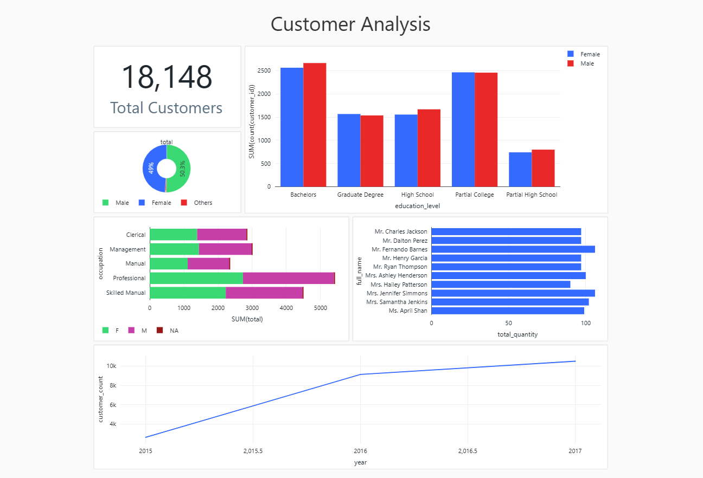

# Adventure Works - Spark

This repository contains code and resources for ingesting, processing, and analyzing the Adventure Works dataset using Databricks, PySpark, Delta Lake, and Python.

## Overview

The Adventure Works dataset is a sample dataset provided by Microsoft, representing a fictional bicycle company. This repository provides a set of notebooks and scripts to perform various tasks on the Adventure Works dataset, including data ingestion, data processing, and data analysis.

## Table of Contents

- [Data Ingestion](#data-ingestion)
- [Data Processing](#data-processing)
- [Data Analysis](#data-analysis)

## Data Ingestion

The data ingestion process involves loading the Adventure Works dataset into your Databricks environment. The repository provides notebooks and scripts to ingest data from various sources, such as CSV files, databases, or external APIs. You can find the relevant code and instructions in the [ingestor](data-ingestion) directory.

## Data Processing

Once the data is ingested, the next step is to process and transform it for analysis. The data processing notebooks and scripts in the [presentation](data-processing) directory demonstrate how to clean, transform, and aggregate the Adventure Works dataset using PySpark and Delta Lake.

## Data Analysis

With the data ingested and processed, you can perform various data analysis tasks on the Adventure Works dataset. The [dashboard](data-analysis) directory contains notebooks that explore customer behavior, product performance, sales trends, and return patterns, providing valuable insights for business decision-making.

